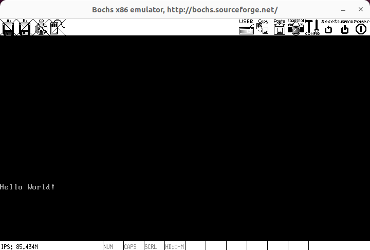

# Ubuntu22.04 开发环境搭建

## Ubuntu22.04 环境下创建 root用户

```bash
$ sudo passwd root
[sudo] password for cc: 
New password: 
BAD PASSWORD: The password is a palindrome
Retype new password: 
passwd: password updated successfully
```

## 安装编译环境

```bash
$ sudo apt install build-essential
$ sudo apt-get install libghc-x11-dev
$ sudo apt-get install xorg-dev
```

## 下载安装虚拟机 Bochs

```bash
# 下载压缩包
$ wget https://udomain.dl.sourceforge.net/project/bochs/bochs/2.6.8/bochs-2.6.8.tar.gz

# 压缩包解压
$ tar -zxvf bochs-2.6.8.tar.gz

# 创建安装目录
$ mkdir bochs

# 进入压缩包解压后的文件目录，配置、编译、安装安装
$ cd bochs-2.6.8
$ ./configure --prefix=/home/cc/bochs --enable-debugger --enable-disasm --enable-iodebug --enable-x86-debugger --with-x --with-x11 LDFLAGS='-pthread'
$ make 
$ make install

# 配置 bochs
$ cd ../bochs
$ touch bochsrc.disk
$ vim bochsrc.disk
megs : 32

romimage: file=/home/cc/bochs/share/bochs/BIOS-bochs-latest
vgaromimage: file=/home/cc/bochs/share/bochs/VGABIOS-lgpl-latest

boot: disk

log: bochs.out

mouse:enabled=0
keyboard:keymap=/home/cc/bochs/share/bochs/keymaps/x11-pc-us.map

ata0:enabled=1,ioaddr1=0x1f0,ioaddr2=0x3f0,irq=14
ata0-master: type=disk, path="hd60M.img", mode=flat,cylinders=121,heads=16,spt=63

#gdbstub:enabled=1,port=1234,text_base=0,data_base=0,bss_base=0

# 创建启动磁盘
$ bin/bximage
1
hd
flat
60
hd60M.img
```

## 安装 nasm 编译器

```bash
$ sudo apt install nasm
```

## 测试代码

```bash
$ cd ~
$ touch mbr.s
$ vim mbr.s
SECTION MBR vstart=0x7c00
	mov ax,0x0000	;设置栈指应该是程序一开始就应该做的事情,这个值是参照1m内存空间布局图选择的，以后会刻意避开
	mov ss,ax
	mov ax,0x7c00
	mov sp,ax	
 
	mov ax,0x0600
	mov bx,0x0700	;BH是设置缺省属性，属性是指背景色，前景色，是否闪烁等，例如07H表示黑底白字，70H表示灰底黑字等等。
	mov cx,0x0000
	mov dx,0x184f	;这个看书p61，同时看其中关于页的知识
	int 0x10
	
	mov ax,0x0300	
	mov bx,0x0000	
	int 0x10
	
	mov ax,0x0000
	mov es,ax
	mov ax,message
	mov bp,ax
	mov ax,0x1301
	mov bx,0x0007	;设置字体属性，02是黑底绿字，07是黑底白字
	mov cx,0x000c
	int 0x10
	
	jmp $
	message db "Hello World!"
	times 510-($-$$) db 0
	db 0x55,0xaa
```

## 编译运行

```bash
# 编译汇编文件
$ nasm -o test mbr.s

# 写入虚拟机启动磁盘
$ dd if=/home/cc/test of=/home/cc/bochs/hd60M.img bs=512 count=1 conv=notrunc

# 启动虚拟机
$ cd bochs
$ bin/bochs -f bochsrc.disk

# 6
# 输入 c (意为 continue)
```



## 参考

- [《操作系统真象还原》第一章 部署工作环境](https://blog.csdn.net/kanshanxd/article/details/130689471)
